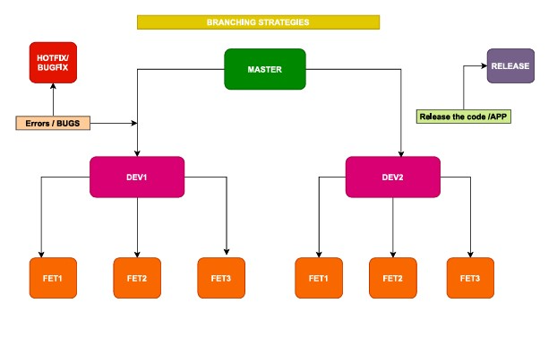

# 🟦 **Branching Strategy Explained (from the image)**

---

# ✅ **1. MASTER Branch (Main Line of Code)**

* This is the **central, stable branch**.
* Only **tested and stable code** goes into master.
* From master we create:

  * **Development branches (DEV1, DEV2)**
  * **Hotfix branches** (for production bugs)
  * **Release branches**

---

# ✅ **2. DEV Branches (DEV1, DEV2)**

* DEV1 and DEV2 are **team-level development branches**.
* Each team works under its own DEV branch.
* Purpose:

  * Avoid conflicts between teams
  * Organize work by modules or squads

Example:
Team A uses **DEV1**, Team B uses **DEV2**.

---

# ✅ **3. Feature Branches (FET1, FET2, FET3)**

* Under DEV branches, developers create **feature branches**.
* Each feature is developed separately:

  * **FET1** → one task
  * **FET2** → second task
  * **FET3** → third task
* After completing the feature:

  1. Developer merges **FET → DEV branch**
  2. Testing happens on DEV branch
  3. After DEV is stable → merge to **MASTER**

This keeps the code clean and avoids conflict.

---

# 🟦 **4. Hotfix/Bugfix Branch**

* For urgent production bugs:

  * Create **Hotfix branch** from master.
  * Fix the bug quickly.
  * Merge back to:

    * **Master** (production)
    * **DEV branches** (to keep code in sync)

This ensures:
✔ Production gets the fix immediately
✔ Development teams also get the patch

---

# 🟦 **5. Release Branch**

* When code in **Master** is ready for deployment:

  * Create a **Release branch**.
  * Only final testing, packaging, and deployment happen here.
* After release:

  * Merge back to master
  * Tag version (ex: v1.0, v2.0)

This keeps production deployments stable.

---

# 🟦 **6. Final Flow Summary (Very Simple)**

1. **Developer → creates feature branch (FET)**
2. **Feature merged → DEV branch (DEV1 / DEV2)**
3. DEV branches tested → merged to **MASTER**
4. From MASTER → create **RELEASE** branch → deploy app
5. If bug found in production → create **HOTFIX** branch → fix → merge back
6. Teams continue working independently via DEV branches

---

# 🚀 **Interview-Ready One Line**

**This is a multi-level Git branching strategy:
Feature branches → Dev branches → Master → Release,
with Hotfix branch for urgent production issues.**

---
