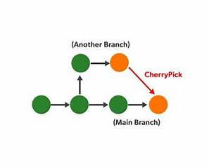
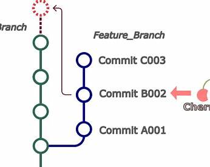
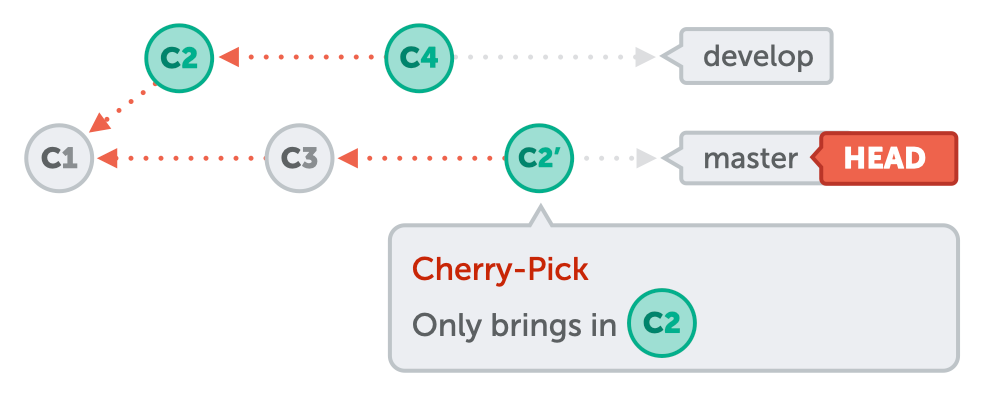
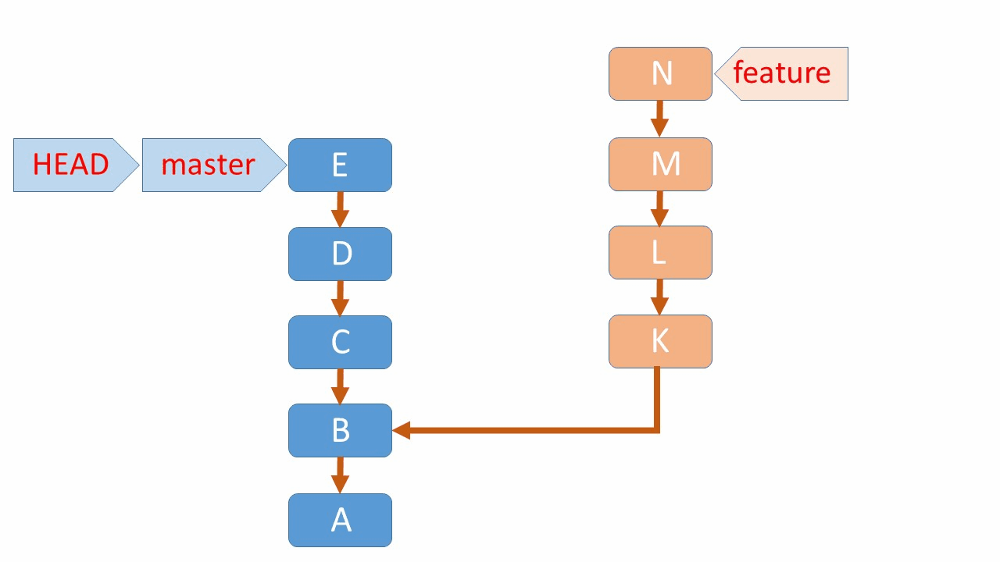

 |  |  | 

# 🟦 Git Cherry-Pick 

1.cherry-pick command used to pick commits from child branch selectively
  from child branch to master branch
2.that commits will be latest commits of the master branch (which meas HEAD)

    syntax: git cherry-pick <child_branch_commit_id>

Here is your **Git Cherry-Pick – Clean, Corrected, Interview-Ready Notes (Session 3 – 21:00 min)**
I kept your points but fixed wording + added clarity for interview use.

---


## ✅ 1. What is Cherry-Pick?

* **Cherry-pick is used to copy a specific commit** from one branch (ex: child/dev branch)
  **into another branch** (ex: master/main branch).
* It is used when you want **only selected commits**, not full branch merges.

---

## ✅ 2. Real-Time Example

Child branch has 10 commits.
You only want commit **#5** to master → you use **cherry-pick**.

---

## ✅ 3. Result of Cherry-Pick

* The picked commit will appear as a **new commit** on the target branch.
* It becomes the **latest commit (HEAD)** of the branch where you applied it.

---

## 🟦 Syntax

```bash
git cherry-pick <commit_id>
```

Example (from child branch to master):

```bash
git checkout master
git cherry-pick <child_commit_id>
```

---

## 🟦 Interview Tip

**Cherry-pick is useful for hotfixes**, where only one specific commit from a feature branch must go to production.

---

