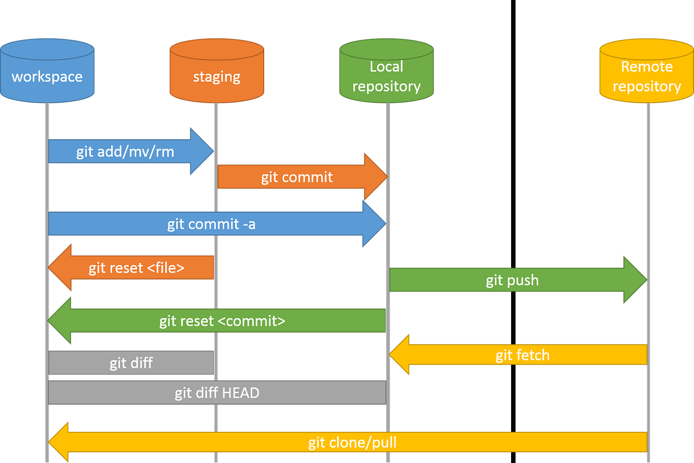
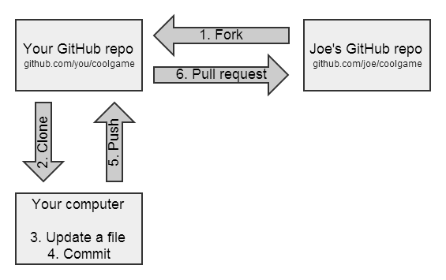

 |  
# 🟦 GitHub Setup + Clone, Fetch, Pull, Fork

# 🟦 Git Clone (Download remote → local)

Clone means **download entire remote repository** into local system.

```bash
git clone https://github.com/user/myrepo.git
```

✔ Creates a new folder
✔ Contains full history + files
✔ origin link set automatically

---

# 🟦 Git Fetch (Download only updates, but not merge)

Fetch = **download changes from remote** but **do NOT update working directory**.

```bash
git fetch
```

### How to see remote branches after fetch?

```bash
git branch -a
```

✔ Fetch shows remote changes but **does not reflect** into your working files.
✔ You only *see* updates, not merge them.

---

# 🟦 Git Pull (Fetch + Merge)

Pull = **fetch + merge**
If remote repo has modified data → `git pull` will update your local files.

```bash
git pull
```

### Important:

* If both local & remote have same data → pull does **nothing**
* Pull only changes files if remote contains **new updates**

---

# 🟦 Push Commands

### ✔ Push only current branch

```bash
git push
```

### ✔ Push ALL local branches to remote

```bash
git push -u origin --all
```

✔ This uploads:

* master
* dev
* feature branches
* every local branch

Useful when you:

* clone old project
* create many branches locally
* want to store all branches in GitHub

---

# 🚀 **Short Interview Tip**

**Pull = fetch + merge. Fetch is safe for inspection, but pull changes your working directory.**

---

# 🟦 GitHub Fork 

---

## ✅ What is a Fork?

* **Fork means making a full copy of someone else’s GitHub repository into your own GitHub account.**
* It is mainly used when you want to:

  * contribute to open-source projects
  * modify someone’s project without affecting original repo
  * maintain your own version of the same project

---

## 🟦 What happens when you Fork a repo?

When you click **Fork**:

* A **new repository** is created under *your GitHub account*
* This repo is an **independent copy** of the original repository
* You can push/pull/modify it freely
* The original owner will not be affected

---

## 🟦 Real-Time Use Case (Simple)

You want to contribute to a public project like Kubernetes or Terraform:

1. Fork the project → copy comes to your GitHub
2. Clone your fork locally
3. Make changes
4. Push to your fork
5. Create a **Pull Request** to original repo’s owner

---

## 🟦 Syntax / Commands

Forking itself is **not a Git command**.
It is a **GitHub feature** done from the web UI.

### After fork → clone your own fork:

```bash
git clone https://github.com/yourusername/forkedrepo.git
```

---

## 🟦 Interview Tip

**Fork = remote copy. Clone = local copy.
Fork is used for open-source contribution; clone is used to bring code into your local system.**

---

