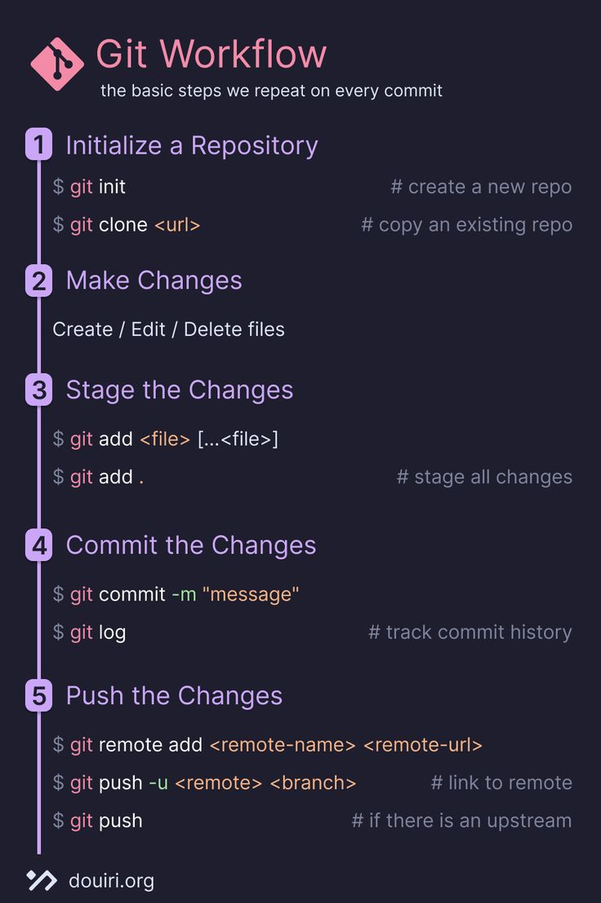

# Workflow



# ✅ 1. GitHub Setup

### **Step 1: Create GitHub Account & Repository**

* Open GitHub
* Click **New Repository**
* Give repo name (example: `myrepo`)
* Select **Private**
* Click **Create Repository**

---

# ✅ 2. Connect Local Repo to GitHub (Link local → remote)

GitHub shows commands; copy-paste them:

### **Add remote origin (link local project to GitHub)**

```bash
git remote add origin https://github.com/user/myrepo.git
```

### **Set branch name as master (optional)**

```bash
git branch -M master
```

### **Push code to GitHub (first time)**

```bash
git push -u origin master
```

✔ This uploads your **local code** → **GitHub repository (myrepo)**
✔ This process is called **Check-In / Push / Upload**

---

# 🟦 3. GitHub Token (Needed for Push)

GitHub asks for a **token** instead of password.

### **Generate Token:**

1. GitHub → Settings
2. Developer Settings
3. Personal Access Tokens
4. Token (Classic)
5. Generate new token
6. Give name (example: `mytoken`)
7. No Expiration
8. Select all scopes
9. Generate
10. Use the token as password during `git push`

---
