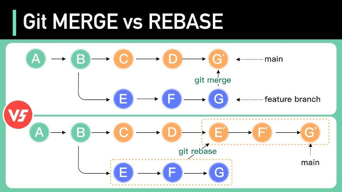
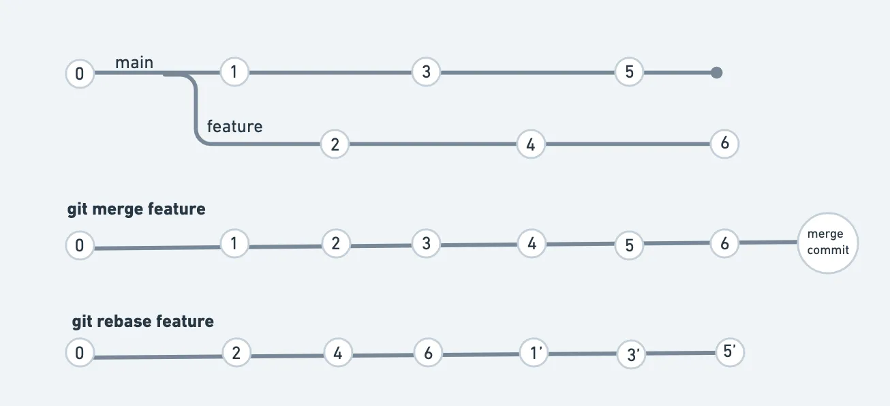

 | 

# 🟦 Git Merge 

---

## ✅ 1. What is Merge?

* **Merge is used to combine child branch commits into master branch.**
* Merge does **not copy** commits → it **joins histories** of two branches.
* Merge keeps the commit history **as it is** (non-linear).

---

## 🟦 2. Commands Used

### ✔ Create a branch

```bash
git branch test
```

### ✔ View all local branches

```bash
git branch
```

### ✔ Switch to a branch

```bash
git checkout branchname
```

### ✔ Create + switch in one command

```bash
git checkout -b branchname
```

### ✔ Merge child branch into master

(You must be inside master branch)

```bash
git checkout master
git merge branchname
```

### ✔ Delete branch (soft delete → merged branch)

```bash
git branch -d branchname
```

### ✔ Delete branch (hard delete → unmerged branch)

```bash
git branch -D branchname
```

### ✔ View logs

```bash
git log
git log --oneline
```

### ✔ View local + remote branches

```bash
git branch -a
```

---

# 🟦 Git Rebase 

---

## ✅ 1. What is Rebase?

* **Rebase moves the child branch commits on top of the latest master commits.**
* Rebase makes commit history **clean, linear, and without merge commits**.
* Rebase is called **fast-forward merging**.

---

## 🟦 2. Steps to Rebase (Real-Time Flow)

### Step 1: Go to child branch

```bash
git checkout childbranch
```

### Step 2: Rebase child branch with master

```bash
git rebase master
```

✔ This moves child branch commits to the top of master.

### Step 3: Switch to master

```bash
git checkout master
```

### Step 4: Merge (fast-forward)

```bash
git merge childbranch
```

✔ No extra merge commit
✔ Fast-forward happens because histories are aligned

---

# 🟦 Merge vs Rebase (Clear Interview Table)

| Feature      | Merge                             | Rebase                                            |
| ------------ | --------------------------------- | ------------------------------------------------- |
| History      | Non-linear, shows merge commits   | Linear, clean                                     |
| Extra commit | Yes (merge commit)                | No                                                |
| Workflow     | Simple, safe                      | Clean but can rewrite history                     |
| Best for     | Teams + shared branches           | Personal feature branches                         |
| When to use  | When you want full commit history | When you want clean history without merge commits |

---

# 🟦 Simple Interview Answer

**Merge preserves history, rebase rewrites history to make it clean and linear.
Rebase = fast-forward.
Merge = combines histories with a merge commit.**

**merge will merge one branch commits into target branch and also it will create new merge commit that will be latest commit**

**rebase will merge child branch commits into master in a fast-forward way**


# 🍰 **Analogy 1: Cake Baking (Merge vs Rebase)**

## **🍰 Git Merge = Mixing Ingredients in One Bowl**

You and your friend are baking cakes separately:

* Your bowl = feature branch
* Friend’s bowl = main branch

When merging, you **combine both bowls into a bigger bowl**.
Everything goes in — nothing is thrown out.
You see the full mixture, lumps and all.

📌 **Merge = Put two sets of ingredients together in one bowl.
History stays messy but complete.**

---

## **🍰 Git Rebase = Re-doing Your Recipe With Updated Steps**

Your friend updates the recipe while you were baking.
Instead of mixing both bowls, you:

* Throw away your current cake batter
* Start fresh with your friend’s updated recipe
* Reapply your steps one-by-one as if you had followed the new recipe from the beginning

📌 **Rebase = Rebuild your work on top of the latest recipe.
History becomes clean and linear.**

---
