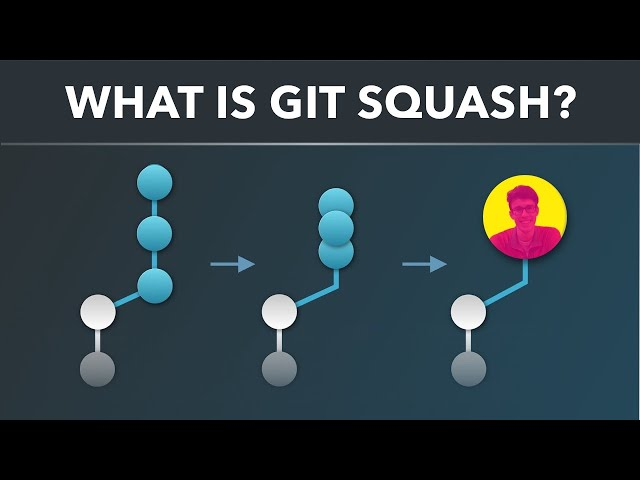

# 🟦 Git Squash 

---

# ✅ **1. What is Squash?**

* **Squash means merging multiple commits into a single commit.**
* It is used to **clean commit history** before pushing code or creating a pull request.
* Stash = temporary hiding
  **Squash = combining commits**

---

# 🟦 **2. Why do we squash commits?**

* If your branch has **too many small commits** like:

  ```
  fix1
  fix2
  update1
  small change
  typo fix
  ```
* Before presenting your work to the team, you want to show a **clean and meaningful commit history**.

**Squash helps shorten the history** into 1–2 clean commits.

---

# 🟦 **3. Command to Squash Commits**

```bash
git rebase -i HEAD~5
```

### Meaning:

* `-i` → interactive mode
* `HEAD~5` → take the last 5 commits
* You can only squash **commits after the oldest one**
  (the first commit in list cannot be rearranged)

---

# 🟦 **4. What happens after the command?**

Your editor (Vim) opens:

```
pick a1b2c3 commit 1
pick d4e5f6 commit 2
pick g7h8i9 commit 3
pick j1k2l3 commit 4
pick m4n5o6 commit 5
```

You can convert any commit to **squash**:

```
pick a1b2c3 commit 1
squash d4e5f6 commit 2
squash g7h8i9 commit 3
squash j1k2l3 commit 4
squash m4n5o6 commit 5
```

This merges all commits into **one single commit**.

---

# 🟦 **5. After saving**

* Git shows a combined commit message window
* You edit the message
* Save → your commits become **one clean commit**

---

# 🟦 Summary (Simple)

| Command            | Use                                            |
| ------------------ | ---------------------------------------------- |
| `stash`            | Temporarily hide changes                       |
| `squash`           | Merge commits into one                         |
| `rebase -i HEAD~N` | Used for squash, reorder, edit, delete commits |

---

# 🚀 **Interview Tip**

**Squash is used to clean up commit history before merging into master.
It keeps the project history clean and professional.**

---
