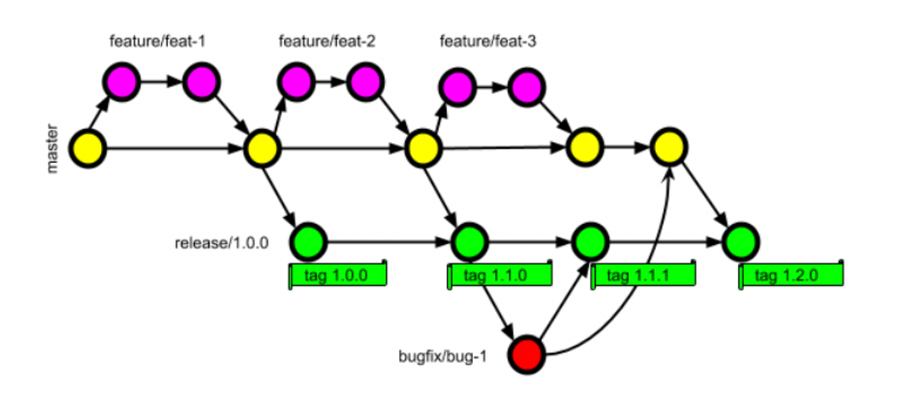
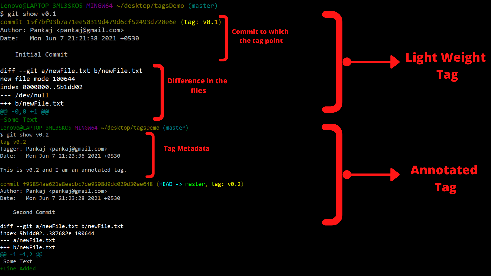

 |  

## 🟦 **Git Tags**

### ✅ **1. What is a Tag?**

* A **tag is an extra name/label given to a commit** to easily identify an important point in the project.
* Tags work like **bookmarks** for specific versions.

### ✅ **2. Why do we use Tags?**

* In real-time projects, repositories have **hundreds of commits**.
* To highlight a **release version**, **milestone**, or **stable point**, we use tags.

### ✅ **3. Create a tag for latest commit (HEAD)**

```bash
git tag Release-2.0
```

* `tag` → command
* `Release-2.0` → tag name
* If you don’t specify commit ID, **Git assigns tag to the latest commit (HEAD)**.

### ✅ **4. Create a tag for a specific commit**

```bash
git tag release-1.0 <commit_id>
```

### ✅ **5. Delete a tag**

```bash
git tag -d release-1.0
```

### ✅ **6. View all tags**

```bash
git tag
```

---

## 🚀 **Short Interview Tip**

**Tags are mostly used for versioning in CI/CD pipelines** — ex: Jenkins builds automatically trigger when a new tag like `v1.2.0` is pushed.

---

## 🟦 **Push a Single Tag to Remote**

```bash
git push origin <tag_name>
```

**Example:**

```bash
git push origin Release-2.0
```

---

## 🟦 **Push All Local Tags to Remote**

```bash
git push --tags
```

---

## 🟦 **Delete Tag from Remote (useful in real projects)**

```bash
git push origin --delete <tag_name>
```

**Example:**

```bash
git push origin --delete Release-2.0
```

---

## 🚀 Interview Tip

**Tags are used for version-based deployments**. Many teams trigger a production build only when a new tag is pushed.

---

Git **doesn’t support direct rename**, so we rename a tag by **deleting and recreating** it.

Here is the clean way:

---

## 🟦 **How to Rename a Tag (Local Only)**

### Step 1: Create a new tag with the correct name

```bash
git tag new-tag old-tag
```

### Step 2: Delete the old tag

```bash
git tag -d old-tag
```

---

## 🟦 **Rename a Tag on Remote Also**

### 1️⃣ Delete the old tag from remote

```bash
git push origin --delete old-tag
```

### 2️⃣ Push the new tag

```bash
git push origin new-tag
```

---

## 🚀 Interview Tip

If someone asks “Can we rename a tag in Git?”, answer:
**Git doesn’t support direct rename. We recreate the tag with a new name and delete the old one.**

